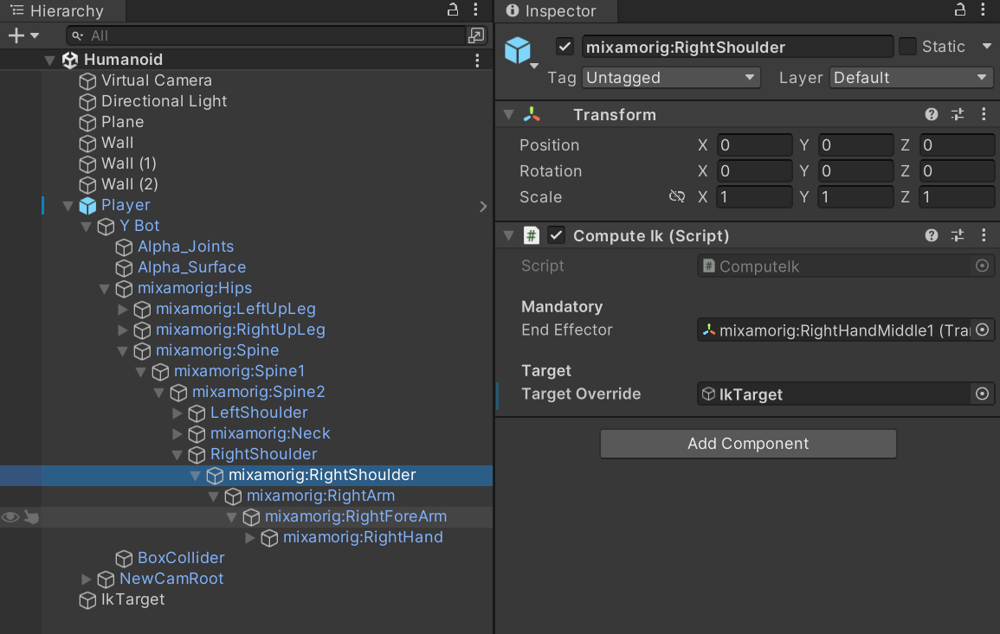

# Inverse Kinematic - Unity

This project aims to understand how Inverse Kinematic algorithms and implement them on a humanoid rig.


## Showcase

To implement different IK algorithm, I created two scripts, ComputeIk.cs, and AbstractJoint.cs.


Since computeIK.cs will search for AbstractJoint.cs in his children, it needs to be placed on the parent of the first joint.


The child class of AbstractJoint.cs will be place on the joints (bones) we want to be calculated.


### Cyclic Coordinate Descend (CDD)

I implemented this algorithm with constraints on bones. As you can see on the joint image, constraints are placed on the minimum and maximum of the bone angles in euler.<br/>
To move the limb manually, you can set the variable ```Target Override``` in ComputeIk.cs with an other object.

Here is a showcase of the algorithm: <br/>


#### Known issues

Since there are no interpolation, the limb can be teleported.<br/> 


If the position is placed at a bad angle and/or position, it is possible the limb cannot stabilize itself and be jittery.<br/>


### Ik Override

I was also able to make an abstract class to override the IK algorithm. Its children only needs to be placed on the joint to be overriden.

For example, I created a behaviour to place the hand on a wall:<br/>


## Tech used

**Engine:** Unity 2022.3.46f1 </br>
**IDE:** Rider


## Credit

Author: Gauthier Bienvenu [@breizhBienv](https://www.github.com/breizhBienv)</br>
From 16/09/2024 to 07/12/2024 </br>
Done at **Isart Digital** in my fourth year in Game Programming.
